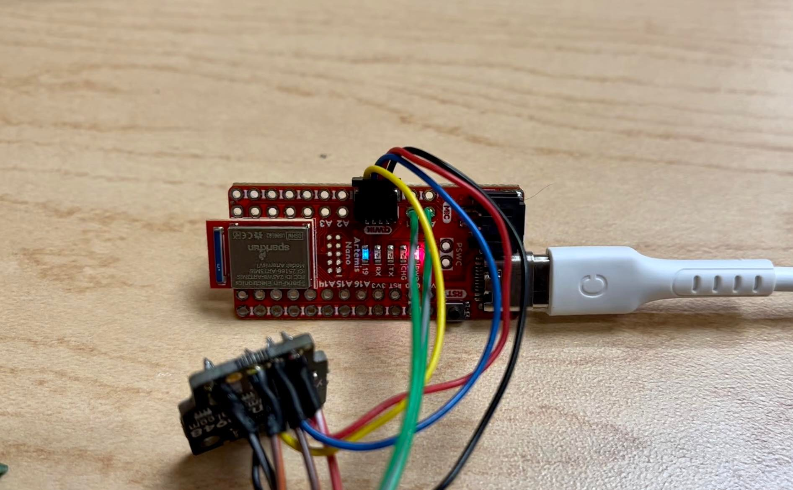
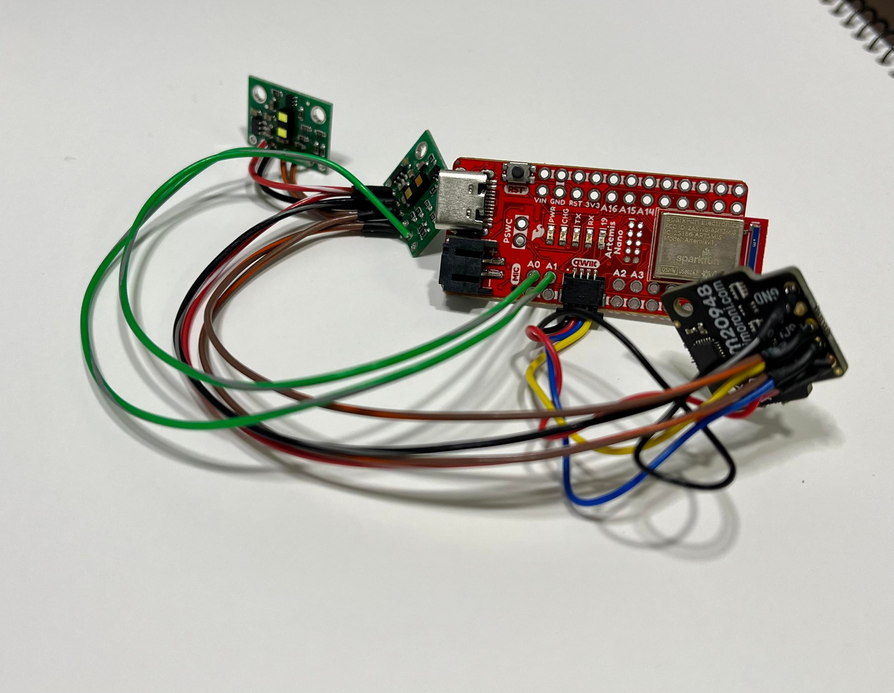
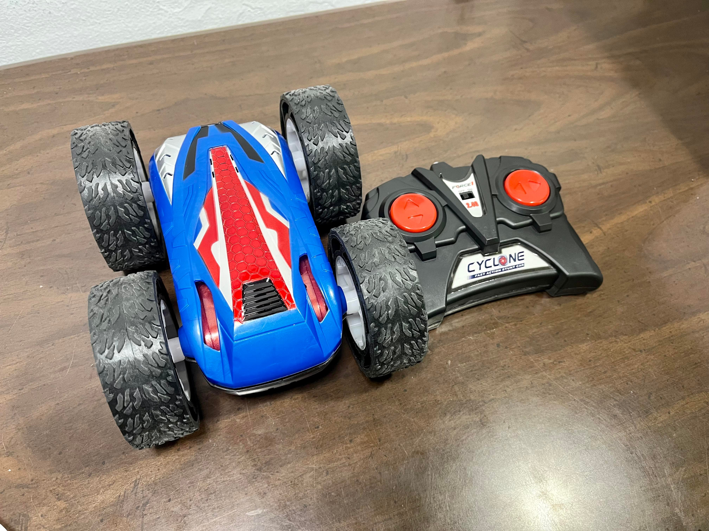
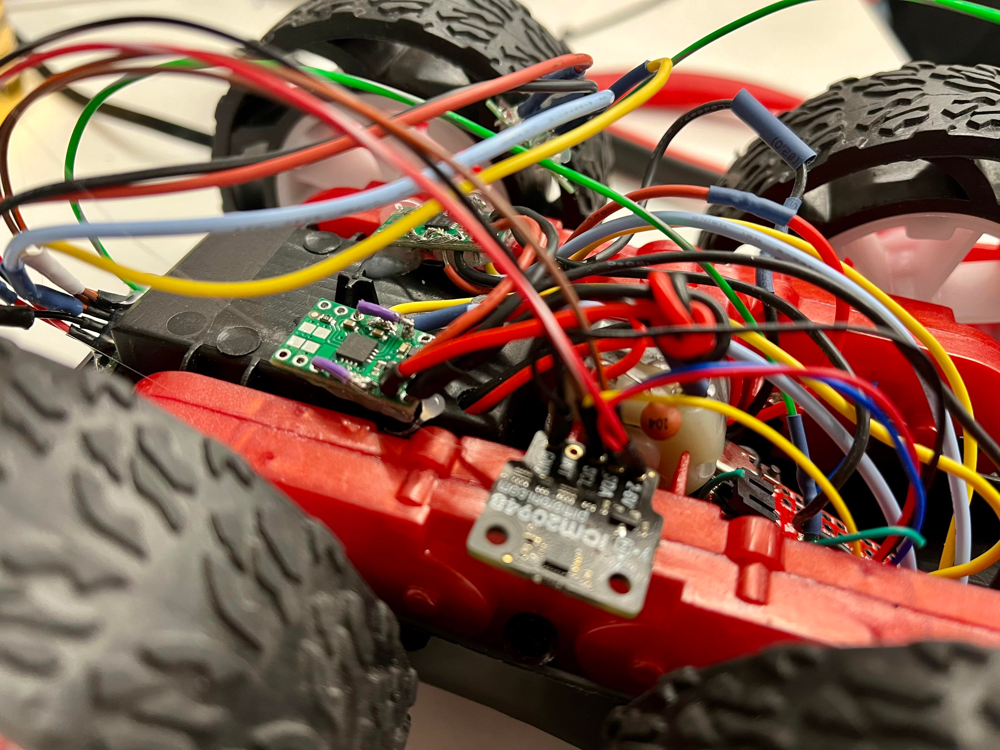

<!-- ---
layout: default
--- -->

[Back to website](https://minjk121.github.io/) 

## ECE4960 Fast Robots

In this course, we design a fast autonomous car and explore dynamic behaviors, acting forces, sensors, and reactive control on an embedded processor. We implement Artemis Nano, motor drivers, time of flight sensors, proximity sensor, and intertial measurement unit. More information can be found [here](https://cei-lab.github.io/ECE4960-2022/).

--
### [Artemis & Bluetooth](labs/lab1_2.html)

### [Sensors](labs/lab3.html)

### [Characterize your car](labs/lab4.html)

### [Motor driver and open loop control](labs/lab5.html)



<!-- ### [PID speed control](labs/lab6.html)
### [Kalman Filters](labs/lab7.html)
### [Stunts](labs/lab8.html)
### [Mapping](labs/lab9.html) -->
<!-- --
Markdown is a lightweight and easy-to-use syntax for styling your writing. It includes conventions for

```markdown
Syntax highlighted code block

# Header 1
## Header 2
### Header 3

- Bulleted
- List

1. Numbered
2. List

**Bold** and _Italic_ and `Code` text

[Link](url) and 
```

For more details see [Basic writing and formatting syntax](https://docs.github.com/en/github/writing-on-github/getting-started-with-writing-and-formatting-on-github/basic-writing-and-formatting-syntax).

### Jekyll Themes

Your Pages site will use the layout and styles from the Jekyll theme you have selected in your [repository settings](https://github.com/Minjk121/ECE4960/settings/pages). The name of this theme is saved in the Jekyll `_config.yml` configuration file.

### Support or Contact

Having trouble with Pages? Check out our [documentation](https://docs.github.com/categories/github-pages-basics/) or [contact support](https://support.github.com/contact) and we’ll help you sort it out. -->
