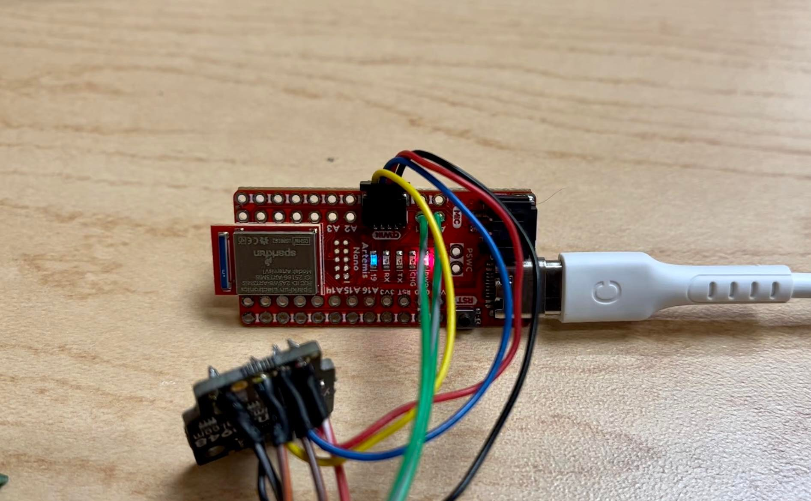
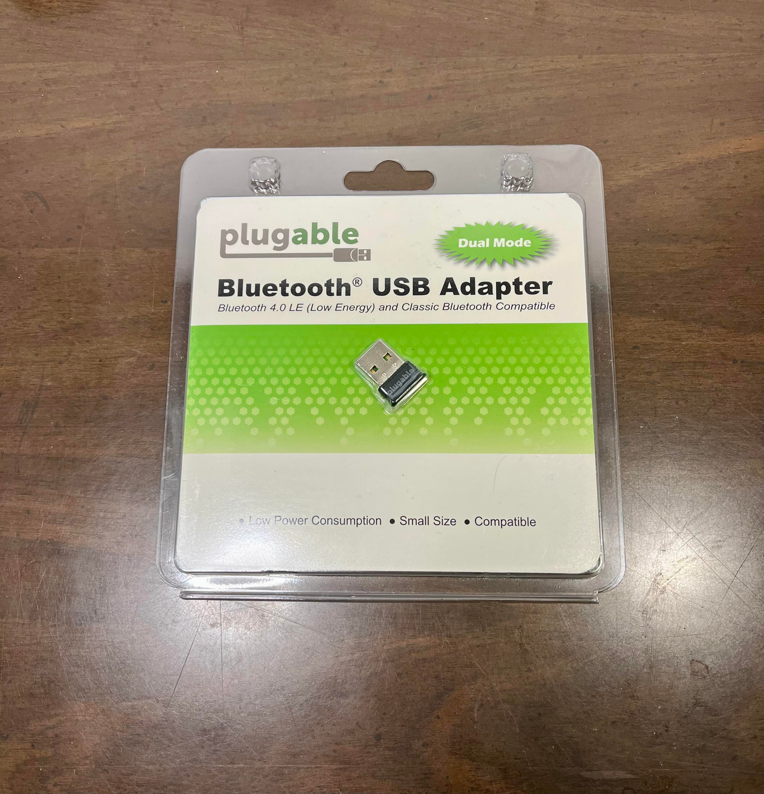

# Lab 1 & 2: Artemis and Bluetooth Communication

The goal of the lab 1 is to set up the basic environment on the Arduino IDE to implement the board and run the example codes. The lab 2 gives the guide to set up the bluetooth and to connect the computer and board. 

## Artemis

Following the [guideline](https://learn.sparkfun.com/tutorials/artemis-development-with-arduino?_ga=2.30055167.1151850962.1594648676-1889762036.1574524297&_gac=1.19903818.1593457111.Cj0KCQjwoub3BRC6ARIsABGhnyahkG7hU2v-0bSiAeprvZ7c9v0XEKYdVHIIi_-J-m5YLdDBMc2P_goaAtA4EALw_wcB), the environment is set up to use the Artemis board. It was important to install all the board packages needed to function the board with Board Manager on the arduino IDE. Without installing, the Artemis example files are not shown or files may have compile errors. 

## Bluetooth
I configured the bluetooth fucntion for the communication between the computer and Artemis board. The lab computer was used instead of my own laptop because the arduino error with Windows 11 OS. After setting up the bluetooth, the address of my Artemis board has been found to be:

Advertising BLE with MAC: c0:07:c1:8d:38:44

