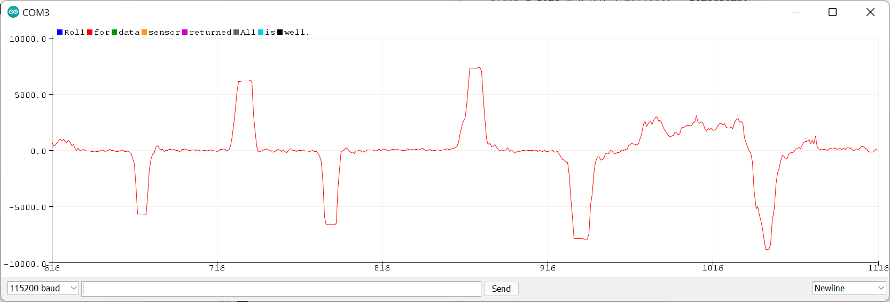

# Lab 3: Sensors


The goal of the lab is to test sensors and equip the robot. In this lab, we will discuss and focus on the Time-of-Flight Sensors (ToF or VL53L1X) and the Inertial Measurement Unit (IMU). We will measure distance with ToF sensors and rotations (pitch/roll/yaw) with IMu sensor. The datasheetcan be found [here](https://cdn.sparkfun.com/assets/8/9/9/a/6/VL53L0X_DS.pdf) for ToF and [here](https://www.digikey.com/en/products/detail/pimoroni-ltd/PIM448/10246391) for IMU.

## Prelab: Wiring Connections

Before starting the lab, it is important to think about how to connect all the parts: Artemis Nano, two ToF sensors, and IMU sensor. Based on the datasheet, we know that sensor has I2C interface. This means the address will be the same for both sensors connected to the board. There are two ways to solve this problem and call each sensor: (1) changing the address by programming or (2) using shutdown pins (XSHUT). 

The picture shows the wiring schematics before the lab below: 


As we use [Qwiic cable](https://www.sparkfun.com/products/14426), we can connect Power, Ground, SDA, and SCL pins in the ToF sensors to the Artemis board closely. It is important to make sure all the pins are connected to the same pins in other boards. I connected shutdonw pins from the sensors to A0 and A1 pin in the board, considering the location of each part in the car. Based on the drawing, I soldered all the parts and wires together. 

## Time of Flight (ToF) Sensors


1. By running Eample05_Wire_I2C file, the I2C addresss of ToF was outputted as 0x29, as expected. 

2. The ToF sensor has three modes: ``` .setDistanceModeShort(), .setDistanceModeMedium(), .setDistanceModeLong(); ```
According to the [datasheet](https://cdn.sparkfun.com/assets/8/9/9/a/6/VL53L0X_DS.pdf), the short distance mode is more immune to ambient light but limied to 1.3m, and the long mode have a limit of 4m but impacted by ambient light. The medium mode is middle-ranging and gets an average impact of ambient light, comparing to the short and long modes.

3. Based on the Example file called ReadDistance, the test for ToF sensor was conducted. At each distance from 200mm to 2000mm, 50 measurements were collected and averaged as shown below:


4. Both ToF sensors were hooked up and simultaneously powered up. To deal with I2C address of two sensors, I decided to reset the one sensor's address by using ```setI2CAddress()```.

## Inertial Measurement Unit (IMU)

Using the Example1_Basics from the SparkFun 9DOF IMU Breakout - ICM 20948 - Arduino Library, I set up and tested IMU. In the code, the AD0_VAL is value of the last bit of the I2C address. It is default to set up as 1 but should be changed to 0 because the ADR jumper is closed.

The pictures below show the serial monitor and plotter results. The sensor values change as I rotate, flip, and accelarate the board. The serial monitor shows accelerometer, gyroscope, nagnetometer values in three axes. The serial plotter shows the gyroscope data in four different colors. The plot shows the result of rotating the board and rotating it back to the original position. The noise can be observed in the plot. 


The accelerometer in z-axis shows 1000 micro tesla which indicates the gravity, while other values are zeros. When I flipped the board, the another axis (x-axis) now shows 1000 micro tesla. 


### Accelerometer

1. Based on the pitch and roll equations in class, we can convert accelerometer data into pitch and roll with atan2 and M_PI. I tilted the board from -90 to 90 degrees and got the plot below. My accelerometer is pretty accurate as the output matches the expected output, as shown in the plot.


The code below is used for getting pitch and roll data.
``` 
  float pitch_a = 180*atan2(sensor->accY(), sensor->accZ()) / M_PI;
  float roll_a = 180*atan2(sensor->accX(), sensor->accZ()) / M_PI;
  SERIAL_PORT.print(" Pitch: ");
  printFormattedFloat(pitch_a, 5, 2);
  SERIAL_PORT.print(", ");
  SERIAL_PORT.print(" Roll: ");
  printFormattedFloat(roll_a, 5, 2);
  ```
2. I tried tapping the sensor and plot the frequency response, following the [tutorial](https://www.alphabold.com/fourier-transform-in-python-vibration-analysis/). In the plot, a high peak is observed near at 0 Hz due to DC signal and spikes are shown due to the tapping. I chose the a local maximum of plot as f_c = 7 Hz and used the formula to find a smoothing constant alpha = 0.5.


The plot shows no more big spikes, but there still exists a noise for pitch and roll angle s even after applying the low pass filter. 


### Gyroscope

1. Based on the lecture notes, the pitch, roll and yaw angles were calculated from the data collected from the gyroscope. The lecture note shows that ```theta_g = theta_g - gyr_reading*dt``` for using the gyroscope to measure angles. 

The following plots show the pitch, roll and yaw angle data from the gyroscope. Compared to the accelerometer pitch data, it has more noise and appeared to have a faster response time to the changes in angle.




The following code was used:
```
   d_t = 0.001* (millis() - time_stamp);
   time_stamp = millis();
   pitch_g =  pitch_g - sensor->gyrY() * d_t;
   roll_g =  roll_g - sensor->gyrX() * d_t;
   yaw_g =  yaw_g - sensor->gyrZ() * d_t;
```
I decreased the sampling rate by increasing the delay time to 30ms to 60ms. Decreasing the sampling rate resulted more noise and spikes in the plot.


### Complimentary filter

The complimentary filter was used for the last part of the lab. The formula for measuring the angle using the complimentary filter is ``` theta = (theta + theta_g * dt)(1 - alpha) + theta_a * alpha```. The complimentary filter allows to get more stable and accurate data.
```
   pitch_g =  (pitch_g + sensor->gyrY() * d_t)*(1 - alpha) - sensor->accY() * alpha;
   roll_g =  (roll_g + sensor->gyrX() * d_t)*(1 - alpha) - sensor->accx() * alpha;
   yaw_g =  (yaw_g + sensor->gyrZ() * d_t)*(1 - alpha) - sensor->accZ() * alpha;
```

