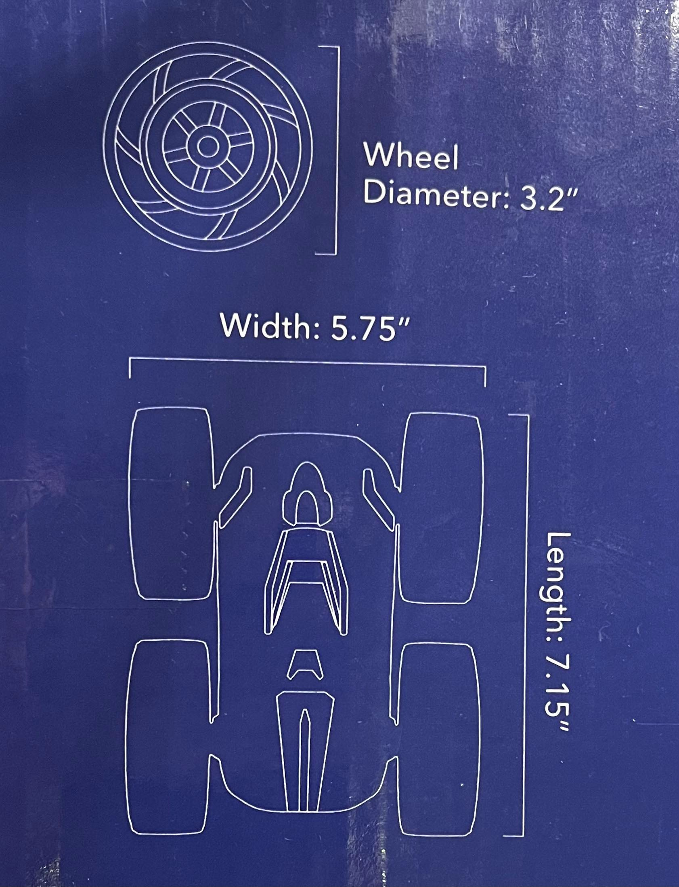
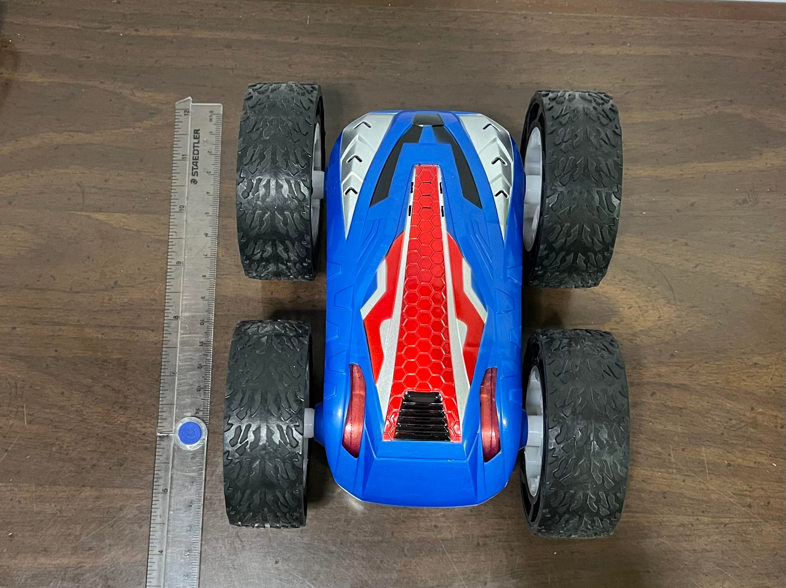
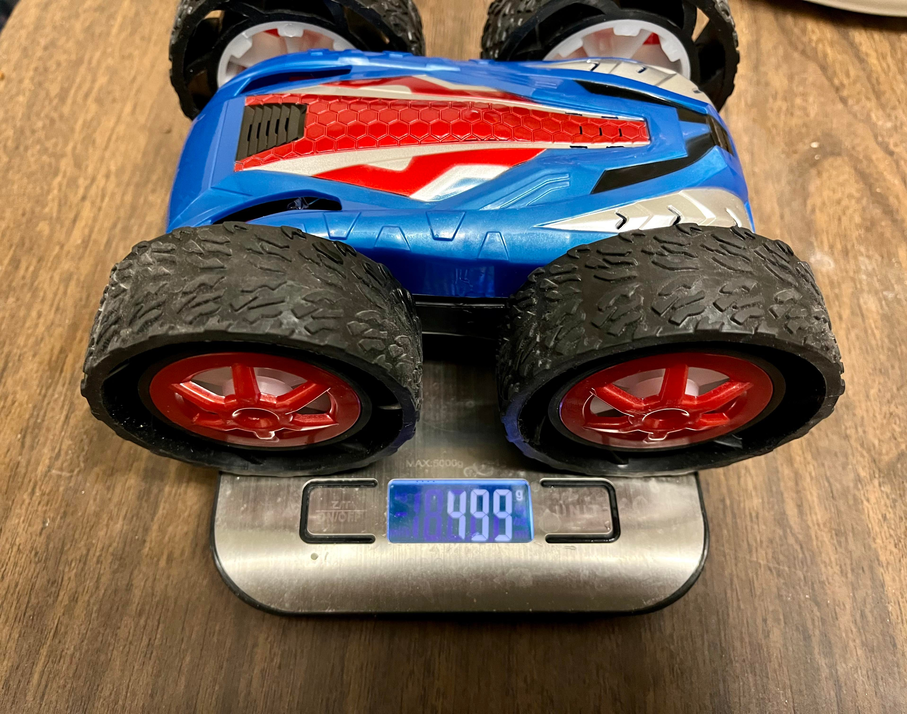
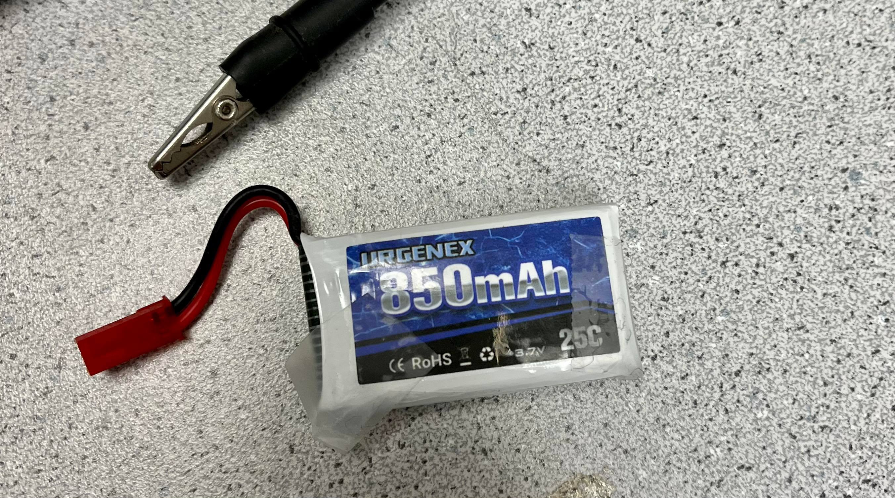
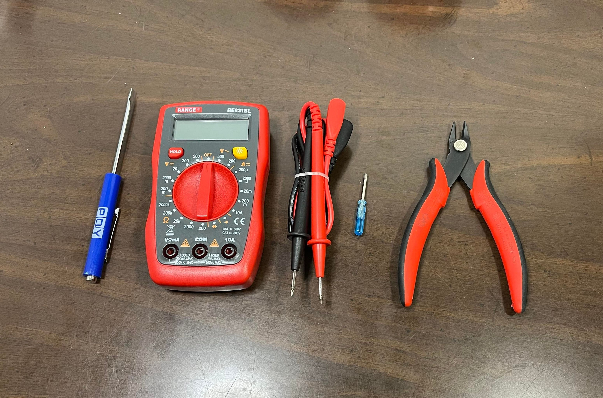
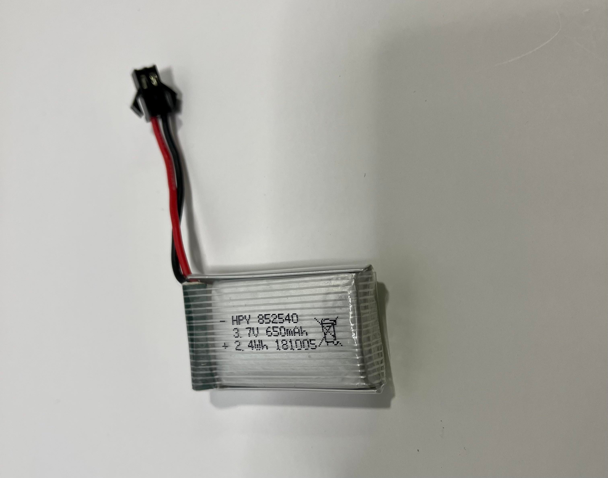

# Lab 4: Characterize your car

The goal of the lab is to understand the characteristics and capabilities of the robot before adding motor drive driver for the future labs. 
Before this lab, the Artemis board, IMU and TOF sensors were soldered and connected.

[Force 1 Cyclone Remote Control Car](https://force1rc.com/products/cyclone-remote-control-car-for-kids-adults) was used with 600mAh and 850mAh battery packs. 

### Category A: Simple Measurements

Simple measurements were collected without any control of the car. Its length, width and wheel diameter are measured as shown in the manual below:

The following pictures demonstrate the method of measuring the length and weight of the robot. A ruler, tape measure, and food scale were used for the tools:

The table demonstrates the static measurements:

|  Length (cm)  |   Width (cm)  |  Height (cm)  |   Weight (g)  | Wheel Diameter (cm) | 
| ------------- | ------------- | ------------- | ------------- | ------------------- | 
|     17.9      |     14.2      |      7.9      |      499      |         7.9         | 

After collecting these static measurements, we used a fully charged 850mAh battery to controlled the car to rotate right and measured the battery life time until it stops with stopwatch. The car shaked and could not be controlled once the battery was out. 

We tried to measure the charging time; however, it took too long to charge. We calculated the estimate charging time by measuring the current with a multimeter which measured to be 50mA. To fully charge the 850mAh battery, it will estimately take 17 hours. The picture below shows the tools used in this lab, including the multimeter:

Table demonstrates the measured battery time and estimated battery charging time in seconds:

|  Battery Time (s) | Est. Charging Time (s) |
| ----------------- | ---------------------- |
|  7 min 52.9 sec   |         17 hrs         |

### Category B: Experimental Setups

After collecting the static measurements, we set up and measured experimental data: braking distance, braking time, deceleration, maximum speed, and rotational speed of the car. Each measurement was collected with three or more trials and the average was calculated. More tools like phone and tape were used to mark the distance, take a video of movements and calculate the results. 

Using 600mAh as shown above, braking distance and decceletaion were measured on the tile in Phillips Hall.
We controlled the car to move forward and immediately back on the point where the tape measure starts. When the car stopped, we collected the distance and the time data. The video below shows how the braking distance (ft) and braking time (s) were collected by using a tape measure.

Deceleration was calculated with the formula of acceleration: a = 2 * displacement / (time^2).
The constant deceleration was assumped in the calculation. The average of multiple measurements are in the table below:

|   Tests on Tile    | Braking Distance (ft) | Braking Time (s) | Deceleration (ft/m^2) |
| ------------------ | --------------------- | ---------------- |---------------------- |
| Average Measurement|          4.667        |      1.21        |          6.375        |

The tests were also conducted with different conditions. The 850 mAh battery was used and experiment was conducted on carpet, but the braking distance was not able to be measured because the car kept on flipping instead of braking due to more powerful battery and higher resistance on the surface. 

The 850mAh battery was used for the rest of the tests below. Maximum speed was measured with distance (11 ft) marked by tapes and timestamps in the following video:

Using the "Edit" function in the iphone photo app, the specific time when the car crosses the starting and ending line can be found. During this measurement, important observation was made. As also shown in the video above, the robot does not move straightly. It varies by cars, but my robot moves relatively straight when it goes backward. All the measurements were conducted with backward movement. 

Average rotational speed with 850mAh was also measured by pressing right botton on the remote control and analyzing the timestamps in the video. The video can be found in Stunts section. It is observed that the car can rotate around its own axis, but the axis moves in a random direction, not staying in the same location. 

|         Tests       | Max Speed on Tile(ft/s) | Max Speed on Carpet (ft/s) |  Average Rotational speed   | 
| ------------------- | ----------------------- | -------------------------- | --------------------------- |
| Average Measurement |           11.96         |             11.76          |         4.0 rev/sec         |

#### Stunts: 

The model allows double sided stunts with 360 degree rotation. With this dynamic movements, three stunts were demonstrated in the following videos:

Rotating right and left:

Front and Back Flipping: 

Drifting: 

The movement was done by Ryan Chan. The sequence is forward, motors off, quick right turn, and quicker left turn.

### Collaboration Credit

Collaborated with Jojo Liang and Ryan Chan
