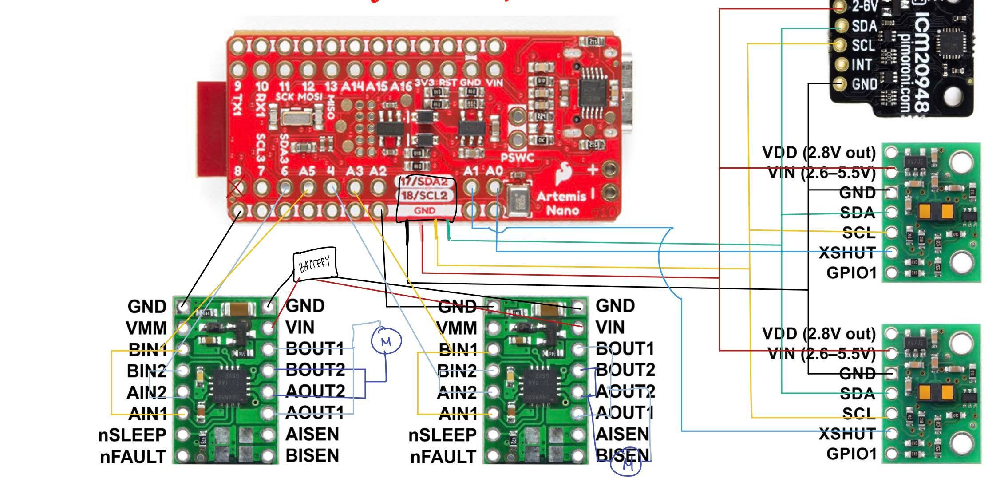
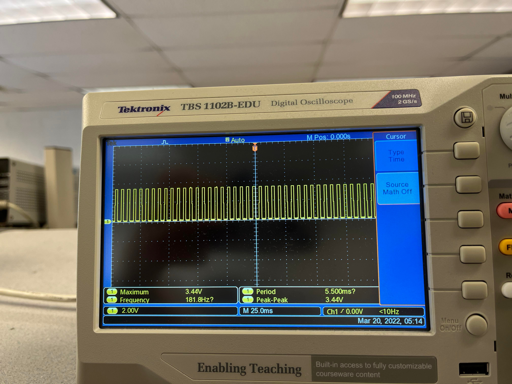
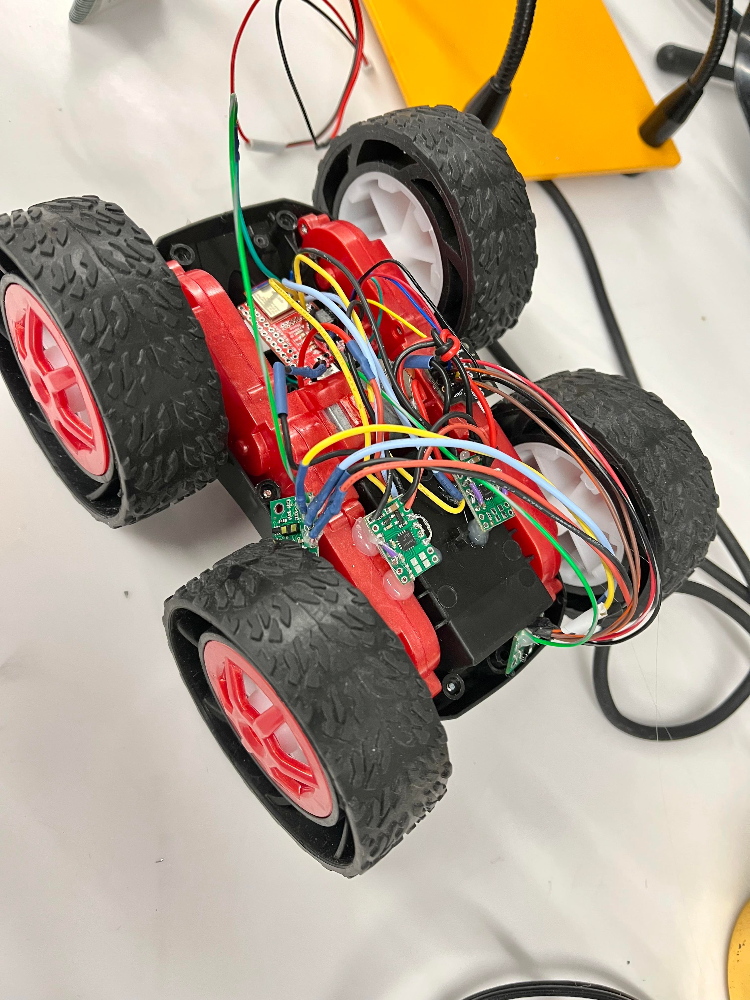

# Lab 5: Motor driver and open loop control

The goal of the lab is to implement two dual motor drivers with the Artemis board and change from manual to open loop control. The car is designed to acheive a speed as a "fast robot" and controlled by pre-progammed series of moves. 

## Prelab
Two dual motor drivers are used with two inputs and outputs connected on each driver. These connections are made to control the robot "fast" enough with delivering enough current. 
By the same reasoning, it is recommended to power the Artemis and the motor drivers from separate batteries for the maximum current flow. 
The [schematics](https://cdn.sparkfun.com/assets/5/5/1/6/3/RedBoard-Artemis-Nano.pdf) indicates that some pins should not be connected by showing the functionality.
Based on the [datasheet](https://www.ti.com/lit/ds/symlink/drv8833.pdf?HQS=dis-dk-null-digikeymode-dsf-pf-null-wwe&ts=1646971142340&ref_url=https%253A%252F%252Fcei-lab.github.io%252F), the wiring connections are planned as shown in the diagram below:


## Lab

I connected the power and signal inputs of motor driver to the Artemis with parallel coupled outputs. I kept the mottor driver (VIN) powered from an external battery for a quick test but would also be reasonable to connect it to the Artemis board because it has the same nominal voltage. 

I used analogWrite() command to generate PWM dignals with following code:
```

void setup() {
  // put your setup code here, to run once:
  pinMode(6, OUTPUT);
  pinMode(A5, OUTPUT);
  pinMode(4, OUTPUT);
  pinMode(A3, OUTPUT);
}

void loop() {
  // put your main code here, to run repeatedly:
  analogWrite(6, 100);
  analogWrite(A5, 100);
  analogWrite(4, 100);
  analogWrite(A3, 100);
}
```
Then, I used an oscilloscope to show that I successfully regulated the power on the output for the motors, as shown below:


The car was taken apart, and the motor drivers were soldered with 850mAh battery connected. 


To test the basic controls of the motor drivers, I used the following codes:

```
void loop() {
  // Task 1

  // forward
  analogWrite(6, 0);
  analogWrite(A5, 100);
  analogWrite(4, 100);
  analogWrite(A3, 0);
  delay(1000);
  
  // coast
  analogWrite(6, 0);
  analogWrite(A5, 0);
  analogWrite(4, 0);
  analogWrite(A3, 0);
  delay(1000);
  
  // reverse
  analogWrite(6, 100);
  analogWrite(A5, 0);
  analogWrite(4, 0);
  analogWrite(A3, 100);
  delay(1000);
  
  // brake
  analogWrite(6, 255);
  analogWrite(A5, 255);
  analogWrite(4, 255);
  analogWrite(A3, 255);
  delay(1000);
}
```
To test the lower limit for which each motor still turns while on the ground, I used the following code:

```
  // Task 2: turn and find the low limit
  while(turn <= 100){
    analogWrite(6, 0);
    analogWrite(A5, turn);
    analogWrite(4, 0);
    analogWrite(A3, turn);

    Serial.print("Forward value: ");
    Serial.println(turn);
    turn++;
    delay(1000);
  }
    // coast
  analogWrite(6, 0);
  analogWrite(A5, 0);
  analogWrite(4, 0);
  analogWrite(A3, 0);
  delay(10000);
```

## Test videos

In the video, the robot car first moves backward, brake (slow stop), forward and coast (slow stop) and repeats.

[](https://youtu.be/3yQ1RO_84jY)

